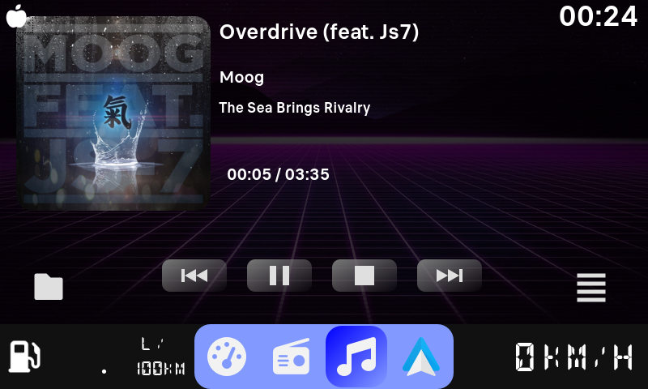
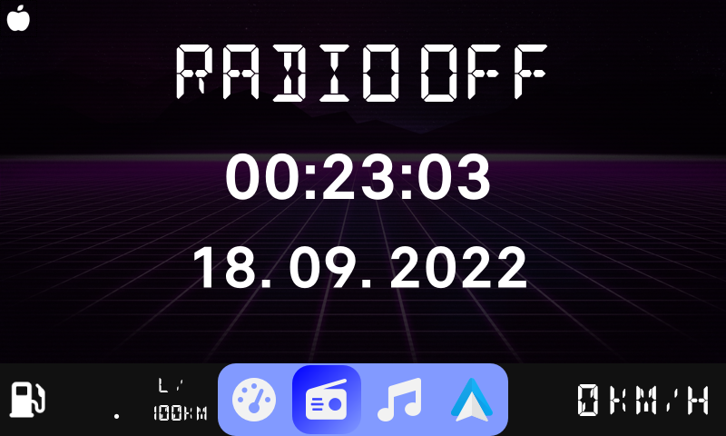
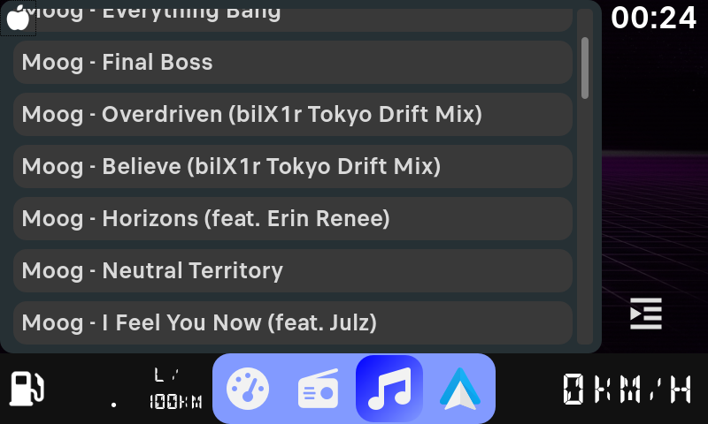
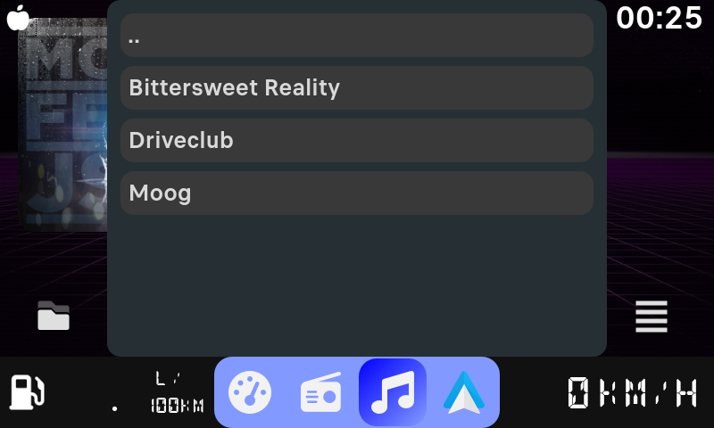

# Peugeot infotainment Project

Infotainment sustav napravljen sa Raspberry Pi računalom i ESP32 mikroupravljačem koji komunicira sa automobilima PSA grupe (Peugeot, Citroen) preko VAN sabirnice.

## Hardware

- Raspberry Pi 3
- Official Raspberry Pi LCD
- ESP32
- MCP2551 CAN bus transceiver
- TSS463C VAN bus driver
- Custom-made PCB na kojem se sve smješteno

[PCB Schematics repo](https://github.com/Mive82/psa-pcb)

## Software

### Raspberry Pi

- Prilagođena Linux disribucija bazirana na Yocto projektu.
- Grafičko sučenje napravljeno u Qt (C++).
  - Prikazuje sve informacije sa originalnog LCD ekrana
  - Prikazuje informacije o motoru
  - USB media player
- API za komunikaciju sa ESP posebno napisan u C.

[GUI App repo](https://github.com/Mive82/psa-app)

### ESP

- Korištena biblioteka za softversko primanje podataka sa VAN sabirnice.
- Softver strukturiran kao API za odgovaranje na zahtjeve za podatke.
- Upravlja paljenjem i gašenjem Raspberry Pi.
- Simulira CD Changer slanjem VAN paketa pomoću TSS463C.

[ESP Firmware repo](https://github.com/Mive82/psa_esp32)

## Komunikacija

Komunikacija između Raspberry Pi računala i ESP se odvija preko UART sučelja. Način razmjene i oblik paketa je napravljen po uzoru na MSP (MultiWii Serial Protocol) koji se koristi na dronovima.  
Radi na način request - response, gdje Raspberry Pi šalje zahtjev (request) za podatke i ESP odgovara (response) sa traženim podacima, ili ne odgovara ako je zahtjev krivog oblika.

# Slike

## GUI

## U autu

# Zahvale

Ovaj projekt ne bi bio moguć bez ovih ljudi:

- [Peter Pinter](https://github.com/morcibacsi)
- [0xCAFEDECAF](https://github.com/0xCAFEDECAF/)
- [Graham Auld](http://graham.auld.me.uk/projects/vanbus/index.html)

Njihovo istraživanje VAN protokola je omogućilo lakši razvoj.

# Dokumentacija

Ovaj repozitorij sadrži površnu dokumentaciju svih komponenti. Za više detalja vidi kod.
