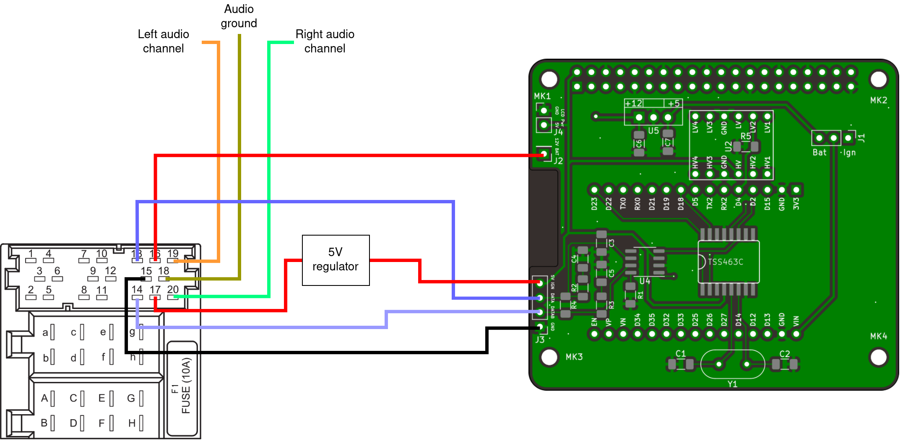

# Peugeot infotainment Project manual

This is a usage manual and behaviour overview of the entire unit.

## Disclaimer

This Unit has only been tested on one car - mine (a 2004 Peugeot 206 with an RD3 radio and a type A lcd display), and thus only the features I can test have been implemented.

## Prerequisites

This unit relies on the original radio and display being present.

Since the unit emulates a CD changer, it must be enabled in the BSI.  
If it's not enabled, the unit will still function, but only as a glorified display. There will be no audio output.

### Enabling the CD changer

If the car had a CD changer fitted at some point, then it's already enabled.

The CD changer must be enabled though diagnostics software. You can either order a Lexia cable and get a hold of Peugeot Planet or Diagbox, find someone who has it, or go to a dealer and ask to have it enabled.

# Connecting the unit

The unit connects to an original VAN based headunit such as an RD3 radio in place of the CD changer.

BEFORE connecting, verify that pins 17 and 16 have power, and that pin 15 is ground.  
If the car has been turned off for some time, pin 17 may not be powered.

## Powering the unit

The v0.1 revision of the PCB does not have an on-board 5 volt regulator for the Pi and display. It does have one for the ESP.

Check the following pins BEFORE connecting the unit:

- Pin 16 is permanent battery power and it's connected to an on-board voltage regulator powering the ESP. It's used for keeping the time and settings when the car goes to sleep.

- Pin 17 is powered when the car is "awake". Here it must be connected to an external voltage regulator that can supply a stable 5.1 volts to power the Raspberry Pi and it's display.

The voltages of Pins 16 and 17 will be around 12 to 13 volts when the car is off, and upwards of 14 to 14.5 volts when it's running.

## Jumper Information

In order to power the ESP, its power source must be selected using the J1 jumper. Connecting Bat and center will power it from permanent battery power, Ign and center will power it along with the Raspberry Pi. This was used for debugging, so it's recommended to power the ESP from permanent battery power.

## Powering the display

The PCB has an extra 5 volt and ground pin (J2) for powering an external LCD display.

## Audio information

The audio input is a line-level input, and a standard phone output will be somewhat quiet.

The wires can be connected to a normal 3.5 mm jack, or directly to an audio hat on the Pi if it's present.

Note: the software on the Raspberry Pi does not enable the on-board 3.5 mm audio, so a USB or HAT solution must be used. The 3.5 mm audio is too quiet anyway.

## Power consumption

The full power draw with the ESP, Pi and Display on 70% brightness is around 700 - 800 mA from the battery. With the display off, it's around 500 mA.

The ESP draws around 150 mA with the Wifi on, 70 mA when it's off. It draws less when it's running at 80 MHz, as opposed to 160.

During deep sleep, the ESP draws around 15 mA. With better hardware design and DC-DC converters, this value could be reduced.

## Extra notes

When assembling the board, make sure that `R4` is not soldered. If it is, it will cause errors in the car and it won't work.

# Firmware and OS

There are two software packages that need to be loaded:

- ESP32 firmware
- Custom OS for the Raspberry Pi

## ESP firmware

The ESP firmware is an arduino sketch that can be uploaded with arduino IDE. Make sure to setup ESP32 in arduino beforehand.

The ESP communicates with the car and relays that information to the Pi using the libPSA protocol over UART.

### Updating

To update the firmware, flash the updated Arduino sketch. Updating from the Pi is not possible.

## Raspberry Pi

A custom linux distribution is built with Yocto, with the custom headunit app preinstalled. To install it, just flash the image with an SD card at least 1.5 GB in size.

As of yet, there is no storage system on the Raspberry, so all the settings are stored on the ESP's memory. They will be reset when the unit loses battery power.

### Updating

The OS doesn't have its own updater yet, so in order to update the OS, a whole reflash is required.

The app can be updated manually without reflashing, but it involves connecting the Pi to the network and sending the program over ssh. That can be done via ethernet. The program binary is located in `/opt/psa-app/bin/psa-app`.

## Power on behaviour

The software generalizes the car's state, and adjusts it's power consumtion accordingly.

| State description                                                   | Raspberry behaviour                                             | ESP behaviour          |
| ------------------------------------------------------------------- | --------------------------------------------------------------- | ---------------------- |
| Car in sleep mode (VAN+ is off)                                     | Turned off (no power to VAN+).                                  | In deep sleep          |
| Car is in Eco mode (battery saving). Reset when engine is turned on | Turned off.                                                     | On, running at 80 MHz  |
| Car off and locked, but not in sleep mode yet                       | Turned off.                                                     | On, running at 80 MHz  |
| Car turned off, but not locked and not in sleep mode                | If coming from states above, turned off, otherwise display off. | On, running at 160 MHz |
| Car turned off, but radio is on. By button or by accessory switch   | Turned on, display on.                                          | On, running at 160 MHz |
| Car turned off, key in accessory position                           | Turned on, display on.                                          | On, running at 160 MHz |
| Car turned off, key in ignition position                            | Turned on, display on.                                          | On, running at 160 MHz |
| Car is cranking the engine                                          | Turned on, display off.                                         | On, running at 160 MHz |
| Engine is running                                                   | Turned on, display on.                                          | On, running at 160 MHz |

If the car goes to Eco mode, it will stay in that state until the engine turns on.

## Setting the time

On first boot, the ESP connects to Wifi once to set the time, and disconnects. Once the time is set, the ESP never connects to WiFi again. The clock drift is less than the stock in-car clock anyway. If a higher precision clock is desired, it can be enabled in software at the cost of slightly higher power draw in deep sleep mode.

## Brightness

The software adjusts the display brightness according to the time of day. The transition start and end times will be exposed to the user in the future.
